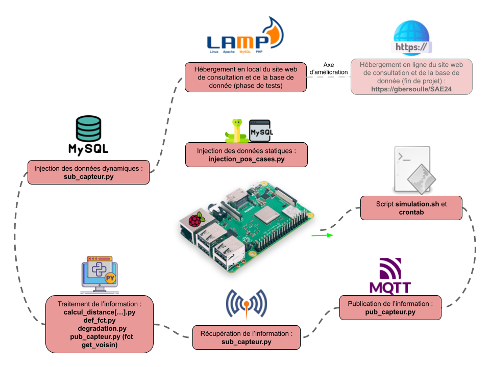
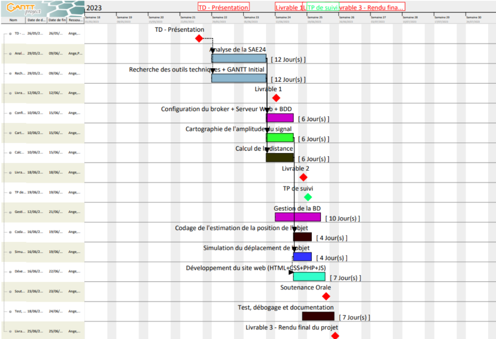
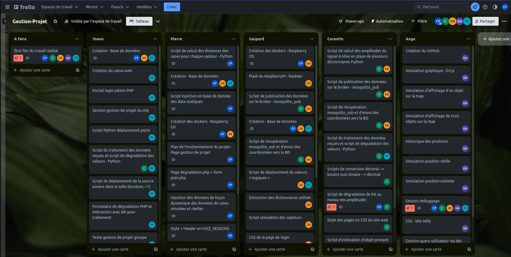
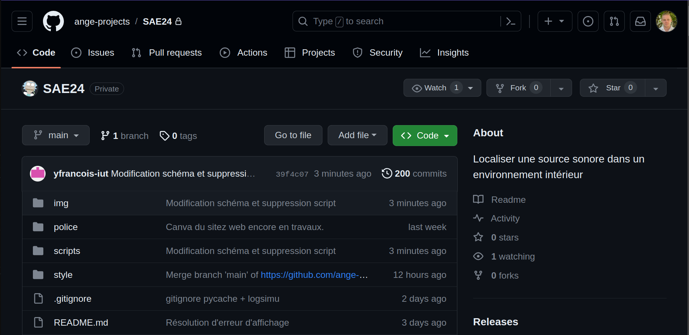

# INDEX
- [INDEX](#index)
- [SAE24](#sae24)
  - [Localiser une source sonore dans un environnement intérieur](#localiser-une-source-sonore-dans-un-environnement-intérieur)
  - [Problématique : Exploiter un signal sonore (sinusoïdale) émis par un objet et reçu par trois microphones. Il faut permettre à une personne de retrouver un objet en lui faisant émettre un son.](#problématique--exploiter-un-signal-sonore-sinusoïdale-émis-par-un-objet-et-reçu-par-trois-microphones-il-faut-permettre-à-une-personne-de-retrouver-un-objet-en-lui-faisant-émettre-un-son)
  - [Situation professionnelle](#situation-professionnelle)
  - [SAÉ24 : Fonctionnalités du projet](#saé24--fonctionnalités-du-projet)
    - [Permettre à une personne de retrouver un objet en lui faisant émettre un son.](#permettre-à-une-personne-de-retrouver-un-objet-en-lui-faisant-émettre-un-son)
    - [Objectifs minimaux :](#objectifs-minimaux-)
- [Gestion de projet](#gestion-de-projet)
  - [Diagramme de Gantt prévisionnel](#diagramme-de-gantt-prévisionnel)
  - [Outils collaboratifs utilisés](#outils-collaboratifs-utilisés)
  - [Synthèse personnelle de chaque membre](#synthèse-personnelle-de-chaque-membre)
    - [Pierre CHAVEROUX](#pierre-chaveroux)
    - [Ange GIUNTINI](#ange-giuntini)
    - [Corentin PRADIER](#corentin-pradier)
    - [Gaspard BERSOULLÉ](#gaspard-bersoullé)
    - [Yoann FRANÇOIS](#yoann-françois)
  - [Synthèse groupée](#synthèse-groupée)
    - [Heures passées sur le projet](#heures-passées-sur-le-projet)
    - [Problèmes rencontrés](#problèmes-rencontrés)
    - [Solutions apportées](#solutions-apportées)
    - [Difficulté ressentie](#difficulté-ressentie)
  - [Conclusion](#conclusion)

# SAE24
## Localiser une source sonore dans un environnement intérieur

## Problématique : Exploiter un signal sonore (sinusoïdale) émis par un objet et reçu par trois microphones. Il faut permettre à une personne de retrouver un objet en lui faisant émettre un son. 

## Situation professionnelle
   * Exploiter un signal sonore (sinusoïdal) émis par un objet et reçu par trois microphones.
   * Estimer la position en (x,y) de l’objet dans une pièce.
   * Présenter l’estimation de la position sur une interface dédiée (site web).

## SAÉ24 : Fonctionnalités du projet
   ### Permettre à une personne de retrouver un objet en lui faisant émettre un son.
   ### Objectifs minimaux :
   * 1 salle gérée
   * Affichage de la position de l’objet
   * Configuration de scénario de déplacements
   * Simulation de déplacement de l’objet en environnement non perturbé
   * Affichage du déplacement estimé de l’objet

# Gestion de projet

Bienvenue sur la page de gestion de projet ! Cette section regroupe toutes les informations essentielles relatives à notre projet, et en particulier à sa planification.

## Diagramme de Gantt prévisionnel
Voici notre diagramme de Gantt prévisionnel réalisé à l'aide du logiciel [GanttProject](https://ganttproject.fr.softonic.com/telecharger) :

## Outils collaboratifs utilisés
- [Trello](https://trello.com/b/KKSacOWL/gestion-projet) est un outil collaboratif en ligne permettant de créer un ensemble de tableaux, de listes et de tâches réalisées/accomplies, réparties au sein des différents membres du groupe. Cet outil nous permettait de suivre la progression de chacun, veillant à donner une vue d'ensemble claire à nos camarades, tout en nous permettant à nous de garder un cap, individuellement.

    

- [GitHub](https://github.com/) est une plateforme de développement logiciel permettant le travail codage collaboratif. Basé sur le système de contrôle de version Git, cet outil nous a permis de travailler localement, de manière indépendante, puis de centraliser l'intégralité de notre travail afin de la partager à nos collègues au sein d'une version cohérente. Cet outil présente des vertus en matière de résolution de conflit puisqu'il permet d'assurer la compatibilité des différentes parties du projet codées par les différents membres du groupe. À l'aide de la version de bureau GitHub Desktop et de la compatibilité accrue avec l'IDE VSCode, nous avons pu efficacement nous répartir les tâches sans perdre en coordination ni cohérence.

    

## Synthèse personnelle de chaque membre

### Pierre CHAVEROUX
- Nombre d'heures passées sur le projet: X h
- Problèmes rencontrés: Insérer problèmes.
- Solutions apportées: Insérer solutions.
- Notation individuelle des membres du groupe: Pierre : ; Corentin : ; Ange : ; Gaspard :

### Ange GIUNTINI
- Nombre d'heures passées sur le projet: X h
- Problèmes rencontrés: Insérer problèmes.
- Solutions apportées: Insérer solutions.
- Notation individuelle des membres du groupe: Pierre : ; Corentin : ; Ange : ; Gaspard :

### Corentin PRADIER
- Nombre d'heures passées sur le projet: X h
- Problèmes rencontrés: Insérer problèmes.
- Solutions apportées: Insérer solutions.
- Notation individuelle des membres du groupe: Pierre : ; Corentin : ; Ange : ; Gaspard :

### Gaspard BERSOULLÉ
- Nombre d'heures passées sur le projet: X h
- Problèmes rencontrés: Insérer problèmes.
- Solutions apportées: Insérer solutions.
- Notation individuelle des membres du groupe: Pierre : ; Corentin : ; Ange : ; Gaspard :

### Yoann FRANÇOIS
- Nombre d'heures passées sur le projet: X h
- Problèmes rencontrés: Insérer problèmes.
- Solutions apportées: Insérer solutions.
- Notation individuelle des membres du groupe: 
- Pierre : ; Corentin : ; Ange : ; Gaspard :

## Synthèse groupée

### Heures passées sur le projet
Insérer heures

### Problèmes rencontrés
Insérer pb

### Solutions apportées
Insérer sol

### Difficulté ressentie
Insérer diff

## Conclusion
Insérer cl
